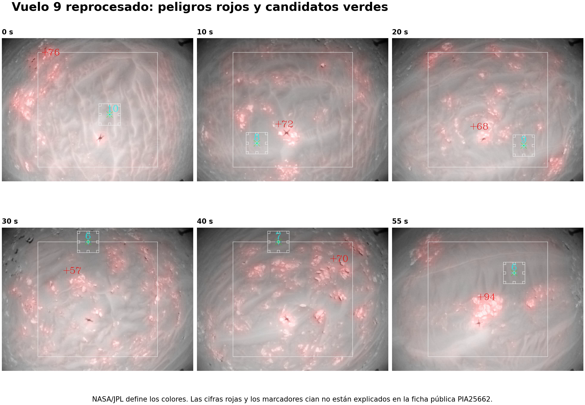
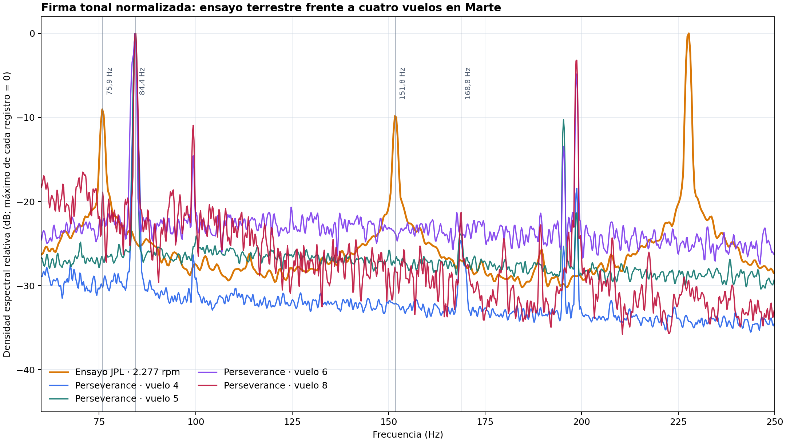
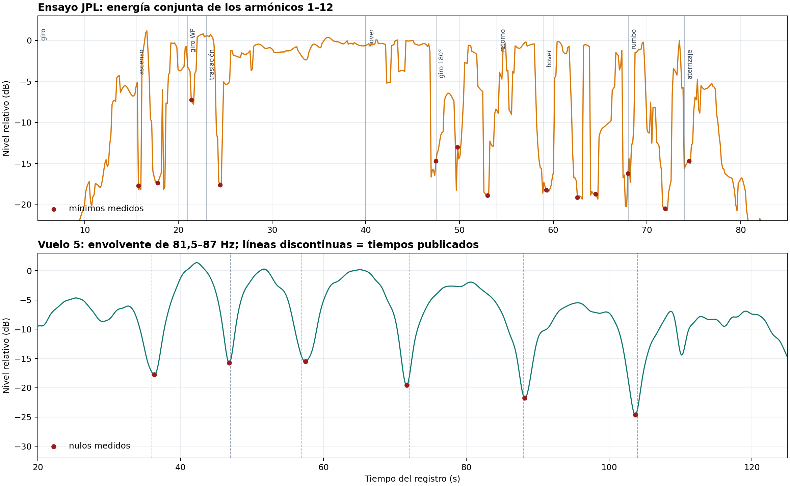

# Contraste técnico: evitación de peligros y firma acústica de Ingenuity

Fecha del análisis: 31 de agosto de 2026  
Revisión documental: 19 de septiembre de 2026  
Estado: análisis exploratorio reproducible; no sustituye telemetría de vuelo ni diagnóstico de ingeniería de NASA/JPL.

## Resultado en una frase

Las imágenes de *Hazard Avoidance Capability* apoyan cualitativamente la idea central del proyecto —el terreno visible aporta o niega información útil—, pero no validan numéricamente nuestra puntuación de referencias. El ensayo terrestre de JPL confirma con mucha precisión la firma armónica de los rotores, mientras que los cuatro WAV de Perseverance muestran la misma familia física desplazada a unos 84 Hz y fuertemente filtrada por la propagación en Marte. No aparece una firma acústica clara de avería en los tramos audibles.

## 1. Qué muestra realmente *Hazard Avoidance Capability*

La ficha oficial de NASA/JPL establece tres hechos:

1. se emplean imágenes del vuelo 9, realizado el 5 de julio de 2021;
2. las imágenes se procesaron después con una capacidad añadida mediante una actualización de software a finales de 2022;
3. el rojo identifica zonas no aptas para aterrizar y el verde candidatos de aterrizaje; el algoritmo puede usar mapas digitales de elevación.

Por tanto, el vídeo no demuestra que esa capacidad estuviera activa durante el vuelo 9. Es una reprocesamiento posterior de la secuencia.

Fuentes:

- [NASA Science Photojournal · Ingenuity's Hazard Avoidance Capability](https://science.nasa.gov/photojournal/ingenuitys-hazard-avoidance-capability/)
- [NASA/JPL · PIA25662](https://www.jpl.nasa.gov/images/pia25662-ingenuitys-hazard-avoidance-capability/)

### Lectura de las superposiciones

| Elemento visible | Lectura permitida por la fuente | Lo que no debe afirmarse |
|---|---|---|
| sombreado rojo sobre rocas/relieve | terreno no apto para aterrizar | que cada píxel rojo sea una roca concreta o una altura exacta |
| marca verde en una zona más lisa | candidato de aterrizaje | que sea la orden final de aterrizaje ejecutada en el vuelo 9 |
| rectángulo blanco grande | región gráfica de trabajo/seguimiento, sin definición pública localizada | su tamaño físico o función exacta |
| cuadrado blanco pequeño alrededor de la marca verde | vecindad gráfica del candidato, compatible con una huella de evaluación | radio de seguridad o dimensiones sin documentación del vídeo |
| cifras rojas `+57`, `+71`, `+76`, `+80`, `+82`, `+94` | valores internos de la visualización, no definidos en la ficha pública | centímetros, altura, riesgo o puntuación concreta |
| círculos y dígitos cian junto al candidato | marcadores internos no definidos en la ficha pública | telemetría de vuelo o equivalencia con nuestra métrica |

La publicación técnica asociada describe una cadena bastante distinta de nuestro contador exploratorio: imágenes monoculares sucesivas → reconstrucción 3D por *Structure from Motion* → mapa de elevación multirresolución → evaluación de pendiente, rugosidad y calidad/incertidumbre → mapa binario seguro/peligroso → candidatos mediante transformada de distancia. Un trabajo posterior añade varios picos candidatos, desplazamiento hacia regiones menos rugosas e inciertas y selección final.

Fuentes técnicas:

- [Multi-Resolution Elevation Mapping and Safe Landing Site Detection with Applications to Planetary Rotorcraft](https://arxiv.org/abs/2111.06271)
- [Optimizing Terrain Mapping and Landing Site Detection for Autonomous UAVs](https://arxiv.org/abs/2205.03522)

### Comparación con nuestra métrica visual

Para el vuelo 9, el montaje público analizado en este repositorio dio:

| Métrica del montaje | Resultado |
|---|---:|
| referencias visuales locales, mediana | 12,5 |
| cobertura de celdas 4×4 | 25,0 % |
| puntuación visual relativa | 12,9 |

Estas cifras describen veinte muestras del montaje público, tras recorte de viñeta y máscara aproximada de la sombra. No son conteos de características del software de vuelo, ni pendiente, rugosidad, altura o incertidumbre del mapa de JPL.

La correspondencia válida es cualitativa:

- las agrupaciones de rocas y el relieve que conservan geometría aparecen como peligros rojos;
- las zonas visualmente más lisas contienen los candidatos verdes;
- la secuencia completa permite integrar información entre imágenes aunque una selección pequeña del montaje tenga pocas esquinas locales;
- por eso el vídeo es un contraste conceptual favorable, no una calibración de `12,9`, `12,5` o `25 %`.

## 2. Material acústico comparado

### Cuatro grabaciones científicas de Perseverance/SuperCam

Se usaron los WAV calibrados `p02` del Planetary Data System para los vuelos 4, 5, 6 y 8. Todos duran 167 s, tienen un canal, 25.000 muestras/s y muestras de 32 bits. Esa estructura fija explica que todos ocupen exactamente 16.700.058 bytes; sus SHA-256 diferentes confirman que el contenido no es igual.

| Vuelo | SHA-256 |
|---:|---|
| 4 | `38d660e70f632c408b5fd0de48e8e863cec519c2088cab3126e668f136cecd12` |
| 5 | `65f23945f1cda44b3f227ee23a192cef0151b6be8693f5a0f8e2645b95961eb3` |
| 6 | `6241c570426839987eef4ccd0ba4725d44090130e65e07c40ade7f7996c6d234` |
| 8 | `84532abb5c6f7bb38f703ad41adc77512fc83355c0aff1c72c3a3544ee5a6c65` |

Fuentes:

- [NASA PDS Geosciences · Mars 2020 SuperCam](https://pds-geosciences.wustl.edu/missions/mars2020/supercam.htm)
- [The sounds of a helicopter on Mars](https://www.sciencedirect.com/science/article/pii/S0032063323000533)

### Referencia terrestre de JPL

La fuente oficial es [NASA Ingenuity Mars Helicopter Testing Media Reel](https://www.youtube.com/watch?v=nAQxNd3uBN0&t=148s), publicado por JPLraw. Dura 3:58 y el ensayo comienza en 2:28. La web incrusta la fuente oficial; la grabación de pantalla analizada no se redistribuye.

Se analizó la pista de audio de la captura aportada:

- duración de audio: 94,848 s;
- AAC mono a 48.000 muestras/s dentro del MP4;
- el propio vídeo muestra `Spin-up (2277 rpm)` y una secuencia de ascenso, traslación, estacionarios, giros, retorno y aterrizaje.

Es una referencia útil, pero no es un WAV científico: contiene codificación AAC, posible normalización de YouTube y una captura móvil. Las amplitudes absolutas y la profundidad de los mínimos no son directamente comparables con el PDS.

## 3. Firma armónica del ensayo JPL

Ingenuity tiene dos palas por rotor. La frecuencia de paso de pala esperada para 2.277 rpm es:

\[
f_{BPF}=\frac{2277}{60}\times 2=75{,}9\ \text{Hz}
\]

En el intervalo estable de la captura se midieron catorce máximos igualmente espaciados. Un ajuste lineal forzado al origen da `75,8813 Hz`, equivalente a `2.276,44 rpm`. La diferencia frente al rótulo del vídeo es `−0,56 rpm` (`−0,025 %`) y el residuo cuadrático medio de esos catorce picos es sólo `0,018 Hz`.

| Armónico | Esperado desde el ajuste (Hz) | Medido (Hz) | Residuo (Hz) |
|---:|---:|---:|---:|
| 1 | 75,881 | 75,882 | +0,001 |
| 2 | 151,763 | 151,794 | +0,031 |
| 3 | 227,644 | 227,646 | +0,002 |
| 4 | 303,525 | 303,528 | +0,003 |
| 5 | 379,407 | 379,395 | −0,012 |
| 6 | 455,288 | 455,276 | −0,012 |
| 7 | 531,169 | 531,158 | −0,011 |
| 8 | 607,051 | 607,056 | +0,005 |
| 9 | 682,932 | 682,938 | +0,006 |
| 10 | 758,813 | 758,820 | +0,007 |
| 11 | 834,695 | 834,686 | −0,009 |
| 12 | 910,576 | 910,583 | +0,007 |
| 13 | 986,458 | 986,496 | +0,039 |
| 14 | 1.062,339 | 1.062,302 | −0,037 |

La coincidencia es demasiado precisa para ser casual: el vídeo contiene la firma tonal real de la rotación. No implica que cada bajada de volumen sea una avería o una parada.

### La comprobación del paper no es la misma grabación

El apéndice 3 de Lorenz et al. separa dos elementos:

- la figura A2 muestra el montaje de vuelo estacionario en la cámara a presión marciana;
- la figura A3 muestra el espectro, el espectrograma y la forma de onda, con una serie armónica cercana a 82 Hz y al menos 15 dientes visibles.

Por tanto, hay dos validaciones distintas:

1. **Vídeo JPL:** `75,8813 Hz → 2.276,44 rpm`, en acuerdo con las `2.277 rpm` del rótulo.
2. **Paper:** una peineta equivalente confirma el mismo principio físico de frecuencia de paso de pala para la misma arquitectura de rotor.

No se comparan como si fueran la misma toma, el mismo tramo o la misma unidad. «Catorce picos» describe el conjunto empleado en nuestro ajuste; «al menos quince dientes visibles» describe la figura A3 publicada.

## 4. Nulos del ensayo JPL frente al vuelo 5 en Marte

### Cronología aproximada del ensayo

Los rótulos que se van añadiendo al vídeo permiten estimar estos comienzos, con una incertidumbre de aproximadamente medio segundo a un segundo y medio por la captura:

| Fase | Tiempo aproximado (s) |
|---|---:|
| inicio del giro | 5,0 |
| ascenso a 1 m | 15,5 |
| giro hacia el punto | 21,0 |
| traslación 0,5 m | 23,0 |
| estacionario | 40,0 |
| giro de 180° | 47,5 |
| retorno | 54,0 |
| segundo estacionario | 59,0 |
| giro al rumbo original | 68,0 |
| aterrizaje | 74,0 |

Al seguir conjuntamente los armónicos 1–12, los mínimos principales aparecen aproximadamente en `15,7`, `17,8`, `21,4`, `24,5`, `47,5`, `49,8`, `53,0`, `59,3`, `62,6`, `64,5`, `68,0`, `71,9` y `74,5 s`. Ocho de las nueve transiciones desde el ascenso hasta el aterrizaje tienen un mínimo a no más de 1,5 s; la excepción clara es el primer estacionario de ~40 s.

Eso indica que la mayor parte de los mínimos de la captura terrestre está ligada a orientación, distancia, maniobra, reverberación de la cámara y control automático de nivel. Los intervalos no forman una cadencia estable.

### Nulos del vuelo 5

La envolvente de 81,5–87 Hz del WAV PDS del vuelo 5 produce mínimos en:

| Detección independiente (s) | Publicación (s) |
|---:|---:|
| 36,3 | 36 |
| 46,8 | 47 |
| 57,5 | 57 |
| 71,7 | 72 |
| 88,2 | 88 |
| 103,7 | 104 |

La coincidencia con los seis tiempos publicados es excelente. Los intervalos sucesivos son aproximadamente `10,5`, `10,7`, `14,2`, `16,5` y `15,5 s`: una modulación mucho más organizada que la sucesión de mínimos del ensayo terrestre.

El artículo atribuye esta estructura a la pequeña diferencia de velocidad entre los dos rotores coaxiales y a la directividad rotatoria de la radiación acústica. Aplicando ese mecanismo a los intervalos observados se infiere una diferencia aproximada de `0,9–1,5 rpm`, alrededor de cuatro centésimas del régimen nominal. Es una inferencia acústica, no telemetría.

Conclusión sobre los nulos: el vídeo de JPL confirma que la geometría y las maniobras pueden producir caídas fuertes de nivel, pero no reproduce de forma limpia la cadencia de nulos del vuelo 5. No conviene usarlo como calibrador temporal de esos nulos marcianos.

## 5. Comparación de los cinco registros

| Registro | Banda fundamental representativa | Régimen equivalente | Tramo tonal claro | Lectura |
|---|---:|---:|---:|---|
| captura del ensayo JPL | 75,881 Hz | 2.276,44 rpm | aprox. 5–85 s | 14 picos medidos y ajustados |
| vuelo 4 | 84,305 Hz | 2.529,1 rpm | aprox. 21,5–143,4 s | fundamental clara, segundo armónico débil, Doppler/modulación |
| vuelo 5 | 84,400 Hz | 2.532,0 rpm | aprox. 14,3–130,0 s | seis nulos publicados reproducidos |
| vuelo 6 | 84,400 Hz | 2.532,0 rpm | aprox. 23,6–68,6 s | se desvanece al aumentar la distancia; 168 Hz no robusto |
| vuelo 8 | 84,400 Hz | 2.532,0 rpm | aprox. 29,7–55,3 s | 84 y 168 Hz; viento/EMI dominantes después |

Los valores de los vuelos son representativos de ventanas largas y no deben leerse como rpm constantes al decimal: el movimiento produce Doppler y el régimen cambia ligeramente. NASA anunció 2.537 rpm para el primer vuelo, coherente con una frecuencia de paso de pala cercana a 84,6 Hz.

Fuente oficial del régimen previsto: [NASA/JPL · Ingenuity Prepares for First Flight](https://www.jpl.nasa.gov/news/nasa-ingenuity-mars-helicopter-prepares-for-first-flight/).

### Por qué en la Tierra hay tantos armónicos y en Marte casi no

- el ensayo tiene micrófono/cámara muy cerca y una sala reverberante;
- Perseverance estaba a decenas o cientos de metros;
- la atmósfera marciana atenúa con fuerza, especialmente las frecuencias altas;
- el viento, la actividad del rover y el ruido del propio micrófono compiten con el helicóptero;
- AAC/YouTube altera amplitudes, pero conserva muy bien la posición de la peineta tonal.

Por eso, el hecho de que en los PDS dominen 84 Hz y a veces 168 Hz, mientras el ensayo conserva armónicos hasta más de 1 kHz, es físicamente coherente.

## 6. Búsqueda de irregularidades

### No se observa una avería acústica clara

- La frecuencia fundamental de los cuatro vuelos permanece cerca del valor esperado durante los tramos audibles.
- La desaparición del vuelo 6 coincide con el alejamiento por encima del alcance acústico útil descrito en el artículo. La anomalía de control de ese vuelo ocurrió ya demasiado lejos para diagnosticarla con este micrófono.
- Los nulos del vuelo 5 son modulación/interferencia, no detenciones del rotor.
- El vuelo 8 conserva la firma esperada antes de que viento e interferencias dominen.

### Impulsos que deben tratarse como artefactos de grabación

| WAV | Instante | Duración aproximada | Lectura prudente |
|---:|---:|---:|---|
| vuelo 4 | 15,675 s | 2,0 ms por encima de 0,8 FS | impulso previo al tramo tonal principal |
| vuelo 5 | 0 s y 42,114 s | una muestra inicial y <0,2 ms | borde/impulso de adquisición |
| vuelo 6 | 0 s | una muestra | borde de adquisición |
| vuelo 8 | 57,308 s | 1,2 ms casi a escala completa | impulso de grabación, viento o EMI; posterior al tono principal |

Ninguno muestra por sí solo una dinámica mecánica de rotor: son demasiado breves, de banda ancha y/o están fuera del tramo tonal.

## 7. Grado de confianza

| Afirmación | Confianza |
|---|---|
| rojo = peligro y verde = candidato | alta; ficha oficial |
| algoritmo usa elevación, pendiente, rugosidad y calidad/incertidumbre | alta; publicaciones técnicas |
| cifras `+57…+94` equivalen a centímetros o riesgo | no establecido |
| peineta de la captura corresponde a 2.277 rpm | muy alta; ajuste de 14 picos |
| figura A3 del paper muestra una estructura armónica equivalente | alta; fuente publicada, sin identificarla como la misma toma |
| seis nulos del vuelo 5 reproducen el artículo | muy alta |
| mínimos del ensayo están dominados por maniobras/geometría | alta para la captura analizada |
| no hay anomalía audible clara en los cuatro vuelos | moderada-alta dentro del alcance del micrófono |
| el audio puede certificar el funcionamiento completo durante todo cada vuelo | baja; la pérdida de señal no es pérdida de rotor |

## 8. Conclusión editorial para el repositorio

La formulación defendible es:

> El vídeo de NASA/JPL demuestra que una secuencia de imágenes puede reconstruir relieve y separar peligros de candidatos de aterrizaje. Nuestra métrica no reproduce ese algoritmo, pero mide una condición previa relacionada: la cantidad y distribución de estructura visible en el montaje público. Los audios PDS añaden una comprobación independiente del régimen de rotor durante cuatro vuelos, sin sustituir la telemetría ni permitir diagnosticar lo que quedó fuera del alcance acústico.

Debe evitarse:

- “nuestra puntuación coincide con la puntuación de JPL”;
- “las cifras rojas son alturas en centímetros”;
- “cada nulo es una parada o fallo del rotor”;
- “el audio prueba que todo el vuelo 6 funcionó normalmente”;
- “el vídeo de 2022 muestra una capacidad usada durante el vuelo 9 de 2021”.

## Reproducción de las figuras

El programa admite `--language es` y `--language en`. Las entradas, dependencias y el alcance exacto del cálculo se documentan en [Reproducción del análisis](REPRODUCIR_ANALISIS.md). Los marcadores temporales son anotaciones previas; no proceden de un detector automático ejecutado por ese programa.
