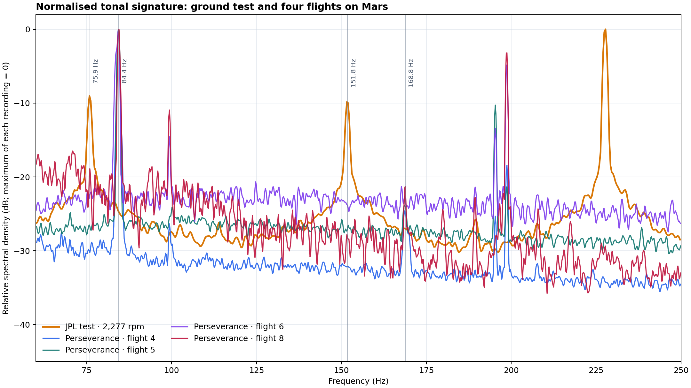
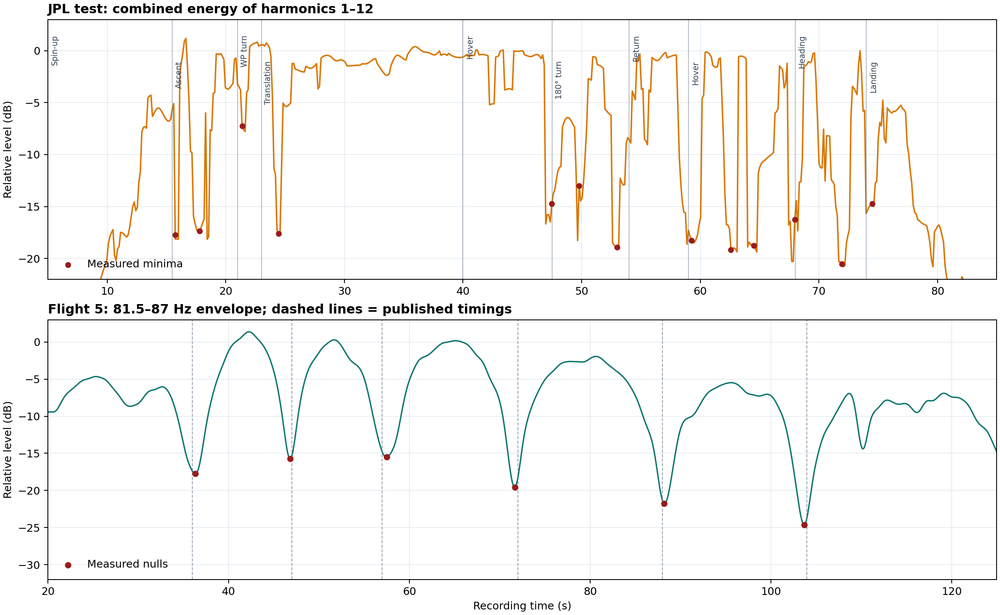

# Technical comparison: Ingenuity hazard avoidance and acoustic signature

[Español](ANALISIS_HAZARD_AUDIO_JPL.md) · [English explorer](index-en.html)

Analysis date: 31 August 2026  
Documentation revision: 19 September 2026  
Status: reproducible exploratory analysis; it does not replace flight telemetry or NASA/JPL engineering diagnosis.

## Main result

*Hazard Avoidance Capability* qualitatively supports the project's central idea—visible terrain supplies or withholds useful information—but does not numerically validate our feature score. JPL's ground test closely confirms the rotors' harmonic signature, while the four Perseverance WAV files show the same physical family shifted to about 84 Hz and strongly filtered by propagation on Mars. No clear acoustic fault signature appears in the audible segments.

## 1. What Hazard Avoidance Capability actually shows

NASA/JPL's official description establishes that:

1. it uses flight 9 images, acquired on 5 July 2021;
2. these were processed afterwards using a capability added in a late-2022 software update;
3. red identifies unsuitable landing areas and green identifies candidates; the algorithm can use digital elevation maps.

The video therefore does not establish that this capability was active during flight 9. It is later reprocessing.

Sources: [NASA Science Photojournal](https://science.nasa.gov/photojournal/ingenuitys-hazard-avoidance-capability/), [NASA/JPL PIA25662](https://www.jpl.nasa.gov/images/pia25662-ingenuitys-hazard-avoidance-capability/).

### Reading the overlays

| Visible element | Supported interpretation | Unsupported claim |
|---|---|---|
| Red shading over rocks/relief | Terrain unsuitable for landing | Each red pixel is a particular rock or exact height |
| Green mark on smoother terrain | Landing candidate | The final landing command executed in flight 9 |
| Large white rectangle | Graphical working/tracking region; no public definition located | Its physical dimensions or exact role |
| Small white square around green mark | Candidate neighbourhood, consistent with an evaluation footprint | Safety radius or dimensions without documentation |
| Red numbers `+57`, `+71`, `+76`, `+80`, `+82`, `+94` | Internal visualisation values not defined publicly | Centimetres, height, risk or a specific score |
| Cyan circles and digits near candidate | Internal markers not publicly defined | Flight telemetry or equivalence to our metric |

The associated technical publication describes a different pipeline from our exploratory counter: successive monocular images → 3D reconstruction by Structure from Motion → multiresolution elevation map → slope, roughness and quality/uncertainty evaluation → binary safe/hazardous map → candidates using a distance transform. A later paper adds multiple candidate peaks, shifts towards smoother, less uncertain regions and final selection.

Technical sources: [Multi-Resolution Elevation Mapping and Safe Landing Site Detection with Applications to Planetary Rotorcraft](https://arxiv.org/abs/2111.06271), [Optimizing Terrain Mapping and Landing Site Detection for Autonomous UAVs](https://arxiv.org/abs/2205.03522).

### Comparison with our visual metric

| Flight 9 montage metric | Result |
|---|---:|
| Median local visual feature count | 12.5 |
| 4×4 cell coverage | 25.0% |
| Relative visual score | 12.9 |

These describe twenty samples of the public montage after vignette cropping and approximate shadow masking. They are not flight-software feature counts or JPL-map slope, roughness, height or uncertainty.

The valid correspondence is qualitative: geometrically distinct rock groups and relief appear as red hazards; smoother areas contain green candidates; the complete sequence can integrate information across images even if a small montage sample contains few local corners. The video provides a favourable conceptual comparison, not calibration of `12.9`, `12.5` or `25%`.

## 2. Acoustic material compared

### Four scientific Perseverance/SuperCam recordings

Calibrated PDS `p02` WAV files were used for flights 4, 5, 6 and 8. Each lasts 167 s, has one channel, 25,000 samples/s and 32-bit samples. This fixed structure explains their identical size of 16,700,058 bytes. Different SHA-256 hashes confirm different contents.

| Flight | SHA-256 |
|---:|---|
| 4 | `38d660e70f632c408b5fd0de48e8e863cec519c2088cab3126e668f136cecd12` |
| 5 | `65f23945f1cda44b3f227ee23a192cef0151b6be8693f5a0f8e2645b95961eb3` |
| 6 | `6241c570426839987eef4ccd0ba4725d44090130e65e07c40ade7f7996c6d234` |
| 8 | `84532abb5c6f7bb38f703ad41adc77512fc83355c0aff1c72c3a3544ee5a6c65` |

Sources: [NASA PDS SuperCam](https://pds-geosciences.wustl.edu/missions/mars2020/supercam.htm), [The sounds of a helicopter on Mars](https://www.sciencedirect.com/science/article/pii/S0032063323000533).

### JPL ground reference

The official source is JPLraw's [NASA Ingenuity Mars Helicopter Testing Media Reel](https://www.youtube.com/watch?v=nAQxNd3uBN0&t=148s), duration 3:58; testing starts at 2:28. The site embeds the official source, not the analysed screen recording.

The supplied capture's audio lasts 94.848 s and is mono AAC at 48,000 samples/s within an MP4. The video displays `Spin-up (2277 rpm)` followed by climb, translation, hovering, turns, return and landing.

It is a useful reference, not a scientific WAV: AAC encoding, possible YouTube normalisation and a mobile capture prevent direct comparison of absolute amplitudes and minima depths with PDS data.

## 3. JPL test harmonic signature

Ingenuity has two blades per rotor. At 2,277 rpm the expected blade-passing frequency is:

\[
f_{BPF}=\frac{2277}{60}\times2=75.9\ \text{Hz}
\]

Fourteen equally spaced peaks were measured in the stable interval. A linear fit constrained through the origin gives `75.8813 Hz`, equivalent to `2,276.44 rpm`. The difference from the displayed speed is `−0.56 rpm` (`−0.025%`), with an RMS residual of `0.018 Hz` across the fourteen peaks.

| Harmonic | Expected from fit (Hz) | Measured (Hz) | Residual (Hz) |
|---:|---:|---:|---:|
| 1 | 75.881 | 75.882 | +0.001 |
| 2 | 151.763 | 151.794 | +0.031 |
| 3 | 227.644 | 227.646 | +0.002 |
| 4 | 303.525 | 303.528 | +0.003 |
| 5 | 379.407 | 379.395 | −0.012 |
| 6 | 455.288 | 455.276 | −0.012 |
| 7 | 531.169 | 531.158 | −0.011 |
| 8 | 607.051 | 607.056 | +0.005 |
| 9 | 682.932 | 682.938 | +0.006 |
| 10 | 758.813 | 758.820 | +0.007 |
| 11 | 834.695 | 834.686 | −0.009 |
| 12 | 910.576 | 910.583 | +0.007 |
| 13 | 986.458 | 986.496 | +0.039 |
| 14 | 1,062.339 | 1,062.302 | −0.037 |

This close agreement supports a genuine rotational tonal signature. It does not mean that every volume decrease indicates a failure or stop.

### The paper's check is a different recording

Appendix 3 of Lorenz et al. separates Figure A2 (hovering set-up in a Mars-pressure chamber) from Figure A3 (spectrum, spectrogram and waveform, with a harmonic series near 82 Hz and at least 15 visible teeth).

There are two validations: the JPL video gives `75.8813 Hz → 2,276.44 rpm`, agreeing with its `2,277 rpm` label; the paper's equivalent comb confirms the blade-passing principle for the same rotor architecture. They are not treated as the same recording, segment or hardware unit. “Fourteen peaks” describes our fit; “at least fifteen visible teeth” describes published Figure A3.

Figure guide: normalised tonal signature, ground test versus four Mars flights. Horizontal axis: frequency (Hz). Vertical axis: relative spectral density (dB), with each recording’s maximum set to 0. Orange: JPL test at 2,277 rpm; blue: flight 4; teal: flight 5; purple: flight 6; red: flight 8. Vertical guides: 75.9, 84.4, 151.8 and 168.8 Hz.

## 4. JPL test minima versus flight 5 on Mars

### Approximate ground-test chronology

The video's accumulating labels give these approximate phase starts, with capture-related uncertainty of about 0.5–1.5 s. Times refer to the analysed capture, not the full official video.

| Phase | Approximate time (s) |
|---|---:|
| Spin-up | 5.0 |
| Climb to 1 m | 15.5 |
| Turn towards target | 21.0 |
| Translate 0.5 m | 23.0 |
| Hover | 40.0 |
| Turn 180° | 47.5 |
| Return | 54.0 |
| Second hover | 59.0 |
| Turn to original heading | 68.0 |
| Landing | 74.0 |

Tracking harmonics 1–12 together gives main minima near `15.7`, `17.8`, `21.4`, `24.5`, `47.5`, `49.8`, `53.0`, `59.3`, `62.6`, `64.5`, `68.0`, `71.9` and `74.5 s`. Eight of nine transitions from climb to landing have a minimum within 1.5 s; the clear exception is the first hover at about 40 s.

Most minima in this capture are thus associated with orientation, distance, manoeuvres, chamber reverberation and automatic level control. The intervals do not form a stable cadence.

### Flight 5 minima

The envelope of the flight 5 PDS WAV's 81.5–87 Hz band gives:

| Independent detection (s) | Published (s) |
|---:|---:|
| 36.3 | 36 |
| 46.8 | 47 |
| 57.5 | 57 |
| 71.7 | 72 |
| 88.2 | 88 |
| 103.7 | 104 |

Agreement with the six published times is close. Successive intervals are about `10.5`, `10.7`, `14.2`, `16.5` and `15.5 s`, a much more organised modulation than the ground-test minima.

The paper attributes this structure to the small speed difference between the coaxial rotors and the rotating directivity of acoustic radiation. Applying that mechanism to the intervals implies a speed difference of about `0.9–1.5 rpm`, roughly four hundredths of one percent of nominal speed. This is an acoustic inference, not telemetry.

JPL's video confirms that geometry and manoeuvres can produce strong level dips, but does not cleanly reproduce flight 5's cadence. It should not calibrate the timing of the Martian minima.

Figure guide: upper panel, combined energy of JPL test harmonics 1–12; lower panel, flight 5 envelope at 81.5–87 Hz. Vertical axes: relative level (dB). Horizontal axis: recording time (s). Red dots: measured minima; lower-panel dashed lines: published times. Upper labels: spin-up, climb, turn towards waypoint, translation, hover, 180° turn, return, second hover, original heading and landing.

## 5. Comparison of the five recordings

| Recording | Representative fundamental | Equivalent speed | Clear tonal segment | Interpretation |
|---|---:|---:|---:|---|
| JPL test capture | 75.881 Hz | 2,276.44 rpm | approx. 5–85 s | 14 measured, fitted peaks |
| Flight 4 | 84.305 Hz | 2,529.1 rpm | approx. 21.5–143.4 s | Clear fundamental, weak second harmonic, Doppler/modulation |
| Flight 5 | 84.400 Hz | 2,532.0 rpm | approx. 14.3–130.0 s | Six published minima reproduced |
| Flight 6 | 84.400 Hz | 2,532.0 rpm | approx. 23.6–68.6 s | Fades with distance; 168 Hz not robust |
| Flight 8 | 84.400 Hz | 2,532.0 rpm | approx. 29.7–55.3 s | 84 and 168 Hz; wind/EMI dominate later |

Flight values represent long windows, not constant rotor speeds accurate to a decimal place: movement causes Doppler shifts and speed varies slightly. NASA announced 2,537 rpm for the first flight, consistent with a blade-passing frequency near 84.6 Hz. [Official planned-speed source](https://www.jpl.nasa.gov/news/nasa-ingenuity-mars-helicopter-prepares-for-first-flight/).

### Why there are many harmonics on Earth and few on Mars

The ground-test microphone/camera is nearby in a reverberant room; Perseverance was tens or hundreds of metres away. Mars strongly attenuates sound, especially higher frequencies. Wind, rover activity and microphone noise compete with the helicopter. AAC/YouTube alters amplitudes but preserves the tonal comb's positions well. Dominant 84 Hz and occasional 168 Hz in PDS recordings, versus harmonics above 1 kHz in the test, are physically consistent.

## 6. Search for irregularities

### No clear acoustic failure observed

The fundamental remains near its expected value during audible segments. Flight 6 fades as distance exceeds the useful acoustic range described in the paper; its control anomaly occurred too far away for this microphone to diagnose. Flight 5 minima are modulation/interference, not rotor stops. Flight 8 retains the expected signature before wind and interference dominate.

### Impulses to treat as recording artefacts

| WAV | Time | Approximate duration | Cautious interpretation |
|---:|---:|---:|---|
| Flight 4 | 15.675 s | 2.0 ms above 0.8 FS | Impulse before main tonal segment |
| Flight 5 | 0 s and 42.114 s | One initial sample and <0.2 ms | Acquisition edge/impulse |
| Flight 6 | 0 s | One sample | Acquisition edge |
| Flight 8 | 57.308 s | 1.2 ms near full scale | Recording, wind or EMI impulse after main tone |

None independently reveals rotor mechanical dynamics: they are too brief, broadband and/or outside the tonal segment.

## 7. Confidence levels

| Claim | Confidence |
|---|---|
| Red = hazard; green = candidate | High; official description |
| Algorithm uses elevation, slope, roughness and quality/uncertainty | High; technical publications |
| Numbers `+57…+94` represent centimetres or risk | Not established |
| Capture comb corresponds to 2,277 rpm | Very high; 14-peak fit |
| Paper Figure A3 shows an equivalent harmonic structure | High; published source, not identified as the same recording |
| Six flight 5 minima reproduce the paper | Very high |
| Ground-test minima dominated by manoeuvres/geometry | High for the analysed capture |
| No clear audible anomaly in the four flights | Moderate–high within microphone range |
| Audio can certify full operation throughout every flight | Low; signal loss is not rotor loss |

## 8. Editorial conclusion for the repository

> NASA/JPL's video demonstrates that an image sequence can reconstruct terrain and distinguish hazards from landing candidates. Our metric does not reproduce that algorithm, but measures a related prerequisite: the amount and distribution of visible structure in the public montage. PDS audio adds an independent rotor-speed check during four flights, without replacing telemetry or diagnosing events beyond acoustic range.

Avoid claims that our score equals JPL's score, that red numbers are heights in centimetres, that each minimum is a rotor stop or fault, that audio proves all of flight 6 was normal, or that the 2022 video shows a capability used during flight 9 in 2021.

## Reproducing the figures

The program accepts `--language es` and `--language en`. Inputs, dependencies and calculation scope are documented in [Reproducing the analysis](REPRODUCING_ANALYSIS.en.md). Timing markers are prior annotations, not outputs from an automatic detector run by this program.
