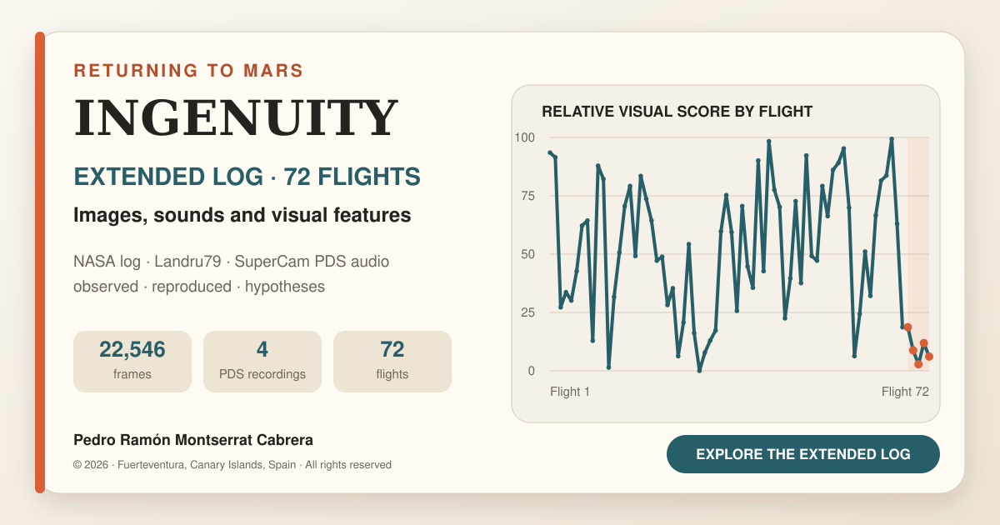

# Ingenuity: an extended log of 72 flights, images and sound from Mars

[Español](README.md) · [English explorer](index-en.html) · [Spanish explorer](index.html)

## Bilingual edition — 19 September 2026

This edition adds an **Español | English** selector while retaining the existing Spanish address. It includes an English explorer, flight notes, controls, accessibility labels, metadata, documentation and CSV downloads. Both languages share the same images, audio and video. English documentation is supplied as Markdown for GitHub and as readable HTML pages for the website, with locally rendered formulas.

The main explorer remains independent of the map. A small playback-error correction now checks the map's selected flight rather than the explorer's selection.

## JPL test and documentation revision

The official JPLraw video, **NASA Ingenuity Mars Helicopter Testing Media Reel**, opens at the chamber test, 2:28. This official embed needs internet access; the analysed screen recording is not redistributed.

The site, formulas, sources, outreach note, citation and third-party notice retain these distinctions:

- Fourteen peaks were measured and used to fit `75.8813 Hz`.
- Paper Figure A3 shows an equivalent comb with at least 15 visible teeth, not necessarily the same recording, hardware unit or spacing.
- Figure A2 documents the chamber set-up; A3 contains the spectrum.
- `75.8813 Hz × 30 = 2,276.44 rpm`, compared with the displayed `2,277 rpm`.
- Flight 4's `2,529.1 rpm` remains an equivalent speed derived from an acoustic window; `≈2,537 rpm` denotes the NASA-published speed.
- 168 Hz is called the second harmonic (`2×BPF`) to avoid overtone ambiguity.
- The article's CC BY 4.0 licence does not automatically apply to JPL's video.

## Explorer and map independence

Unzip the entire package and open `index.html` or `index-en.html`. Keep the folders alongside the HTML files. To update the existing repository, upload the extracted contents to its root, not just the ZIP. No new repository or visibility change is needed.

The main explorer and map index start at flight 1 independently. Where available, `requestVideoFrameCallback` follows displayed video frames, backed up by playback and seek events. Intermediate seek updates do not replace the requested selection. The former artificial 0.05 s lead is absent.

Upper buttons, dropdown, chart and table update only the still image, details and explorer score. Only the map's 72 buttons seek and play the official animation. Playback and scrubbing update only the map index, which scrolls within its own panel without moving the page.

Validation details for this edition are in [the review report](REVISION_PUBLICACION.md). Earlier Spanish-package checks recorded 72 markers (flight 1: 0.2 s; flight 72: 56.6 s), a 69.1 s local video, four 167.03 s local audio previews and separation of explorer/map calls. Earlier browser validation described direct-file and repository-subpath operation, all buttons and filters, media loading and 390 px adaptation. These are historical checks; the review report distinguishes the checks run for this edition. Navigation tests do not constitute new scientific validation or testing in every browser.

> **© 2026 Pedro Ramón Montserrat Cabrera — Fuerteventura, Canary Islands, Spain. All rights reserved.** Public reading and attributed citation do not grant an open-source licence. Reproduction, redistribution, modification or commercial use of original contributions requires prior permission. See [LICENSE](LICENSE.en.md) and [NOTICE](NOTICE.en.md).

A personal project by **Pedro Ramón Montserrat Cabrera**, based on NASA's official flight record, NASA/JPL-Caltech's complete flight map, Jacint Roger's (Landru79) chronological montage of public imagery, a uniform exploratory analysis of visible references and calibrated SuperCam recordings archived in the Planetary Data System.

The aim is a publicly accessible **extended pilot's log**: move forwards and backwards among flights, images, audio, incidents and independent analysis. It is not internal Ingenuity telemetry and does not replace NASA/JPL's investigation.

The static site needs no database or application installation and can be hosted by GitHub Pages.

## Repository contents

| File or folder | Contents |
|---|---|
| `index.html`, `index-en.html` | Spanish and English interactive explorers |
| `datos/ingenuity_72_vuelos.csv` | 72-flight table; English counterpart uses `.en.csv` |
| `datos/mapa_oficial_72_vuelos_tiempos.csv` | 72 verified flight-label timestamps |
| `datos/audio_ingenuity_pds.csv` | Traceable WAV/XML catalogue |
| `datos/comparacion_audio_jpl_perseverance.csv` | Frequency, equivalent speed and tonal-duration comparison |
| `datos/nulos_audio_comparados.csv` | Ground-test and flight 5 minima |
| `datos/plantilla_revision_lomas.csv` | 72-row ridge-review protocol |
| `datos/vuelos_alta_velocidad_hipotesis.csv` | Flights 62/68/69, calculations and evidence levels |
| `assets/audio/` | Filtered MP3 listening previews |
| `assets/video/ingenuity-72-flight-map-960x540.mp4` | Lightweight official map copy for local navigation |
| `assets/spectrograms/` | 0–250 Hz comparisons of four sessions |
| `assets/analisis/` | Flight 9 overlays, normalised spectra and minima comparisons |
| `analisis/comparar_audio.py` | Acoustic figure generation from original recordings |
| `assets/social-card.png`, `assets/social-card-en.png` | Spanish and English sharing cards |
| `assets/social-card.svg`, `assets/social-card-en.svg` | Editable vector covers |
| `assets/favicon.svg` | Site icon |
| `SOURCES_AND_METHOD.en.md` | Sources, method and limitations |
| `LEGEND_FORMULAS_AND_CRITERIA.en.md` | Chart interpretation, formulas, ΔRPM, ridges and JPL comparison |
| `HAZARD_AND_AUDIO_ANALYSIS.en.md` | Hazard video, ground test and four PDS recordings |
| `OUTREACH.en.md` | Abstract, LinkedIn draft and publication guidance |
| `CITATION.cff` | Citation metadata for GitHub's Cite this repository |
| `LICENSE`, `NOTICE.md` | Original terms and third-party attribution; English counterparts included |
| `.nojekyll` | Prevents Jekyll processing |

All seven CSVs have English `.en.csv` counterparts with unchanged numerical data. The flight 9 figure has an English title and explanatory note, with the original frames preserved. Other archived analytical plots retain their original labels, accompanied by English captions and complete axis/legend keys. English document HTML counterparts use `.en.html`.

## Updating GitHub Pages

For this existing repository, follow [ACTUALIZAR_GITHUB.md](ACTUALIZAR_GITHUB.md). In outline: extract the package, open the existing repository, choose **Add file → Upload files**, upload the contents at the root and commit. Preserve `assets`, `datos`, `analisis` and the added documentation assets. Wait for the Pages deployment to succeed.

The existing Spanish address remains:
https://pedroramon-estudios.github.io/Ingenuity-72-vuelos/

The English address after upload is:
https://pedroramon-estudios.github.io/Ingenuity-72-vuelos/index-en.html

For a new deployment only, GitHub Pages can be configured under **Settings → Pages → Build and deployment → Deploy from a branch**, selecting the repository's publishing branch and `/(root)`. Do not change a working configuration unnecessarily.

Sharing cards have the corresponding language's canonical address and a 1200 × 630 image. After publishing, [LinkedIn Post Inspector](https://www.linkedin.com/post-inspector/) can refresh cached previews.

### Publication checklist

1. Open both language pages and switch between them.
2. Select flights through buttons, dropdown, chart and table: details change while the map stays independent.
3. Select map flight numbers; the video seeks and plays inside the page.
4. Scrub the map both ways: only its index follows.
5. With internet access, open the JPL test at 2:28; the direct link remains available if embedding is blocked.
6. Check all four audio players and at least one PDS WAV link.
7. Open English documentation, formulas and CSV downloads.
8. Review the shared-link preview before posting.

## Short LinkedIn draft

> After studying Ingenuity's sounds, shadows, landings and incidents separately, I wanted to bring them together in one extended, publicly accessible log.
>
> This interactive chronology combines NASA/JPL's official flight record and 72-flight map, Landru79's visual montage, exploratory Navcam feature analysis and Perseverance's SuperCam recordings of flights 4, 5, 6 and 8.
>
> It offers a way to revisit the mission, compare flights and distinguish observations, reproduced results and hypotheses. It also documents the initial 31-image ridge observation and a protocol to test it, alongside the high-speed/Sys-ID history of flights 62, 68 and 69. Neither ridge preference nor prior fatigue is presented as established.
>
> Explore the log: https://pedroramon-estudios.github.io/Ingenuity-72-vuelos/

## Listening and downloading

Local MP3 previews derive from calibrated `p02` WAVs using 60–220 Hz filtering and normalisation for easier listening. They must not be used for quantitative measurements. Each card links to its original PDS WAV (mono, 25 kHz, 167 seconds), with XML labels recorded in the catalogue. The acoustic paper reports clock offsets of tens of seconds; the site does not force exact audio–image synchronisation.

## Ground test: two separate checks

Fourteen equally spaced peaks measured in the analysed capture give `75.8813 Hz`, or `2,276.44 rpm`, agreeing with the video's `2,277 rpm`. Appendix 3 of Lorenz et al. independently shows the chamber set-up in A2 and an equivalent near-82 Hz comb with at least 15 visible teeth in A3. This confirms the expected physical structure, not identity of recordings or pixels.

## Map navigation

The official UHD animation's 72 `Flight Number` labels were reviewed at 10 fps. The CSV makes navigation markers auditable at ±0.1 s sampling precision. They are not take-off times, flight durations, coordinates or telemetry. The 639.35 MB UHD master is not redistributed; the repository includes a 960×540 copy. Local-file navigation works without the YouTube API. The main analytical selection remains fixed during playback.

## Subsequent updates

Editing or uploading files and committing updates the Pages site after deployment without changing its address. Keep both language editions aligned when the study changes.

## Attribution and citation

Mission images/data and map: NASA/JPL-Caltech and relevant teams. Official record: NASA Science, Ingenuity mission. Chronological public-image montage: Jacint Roger (Landru79). Analysis, selection and narrative: Pedro Ramón Montserrat Cabrera, Fuerteventura, Canary Islands, Spain.

An independent public-study project with no NASA/JPL affiliation or endorsement. Third-party materials retain their original terms. Public availability does not transfer ownership or make original contributions open source.

> Montserrat Cabrera, Pedro Ramón (2026). *Ingenuity: log ampliado de 72 vuelos, imágenes y audio de Marte*. Fuerteventura, Canary Islands, Spain. https://github.com/pedroramon-estudios/Ingenuity-72-vuelos
