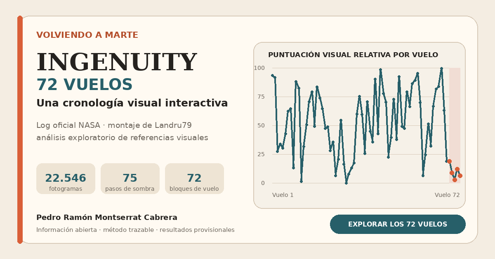

# Ingenuity: 72 vuelos, una cronología visual interactiva

Proyecto personal de **Pedro Ramón Montserrat Cabrera** construido a partir del registro oficial de vuelos de NASA, un montaje cronológico de imágenes públicas elaborado por **Jacint Roger (Landru79)** y un análisis exploratorio uniforme de referencias visuales.

La página es completamente estática: no necesita base de datos, instalación ni servidor. GitHub Pages puede publicarla gratuitamente.

## Contenido del repositorio

- `index.html`: web completa e interactiva.
- `datos/ingenuity_72_vuelos.csv`: tabla descargable de los 72 vuelos.
- `assets/social-card.png`: portada para LinkedIn y redes sociales.
- `assets/social-card.svg`: versión vectorial editable de la portada.
- `assets/favicon.svg`: icono de la página.
- `FUENTES_Y_METODO.md`: trazabilidad, método y límites.
- `.nojekyll`: evita que GitHub transforme los archivos.

## Publicarlo gratis en GitHub Pages

### 1. Crear el repositorio

1. Entra en [GitHub](https://github.com/) e inicia sesión.
2. Pulsa **New repository**.
3. Escribe como nombre: `ingenuity-72-vuelos`.
4. Selecciona **Public**.
5. No marques ninguna opción adicional y pulsa **Create repository**.

### 2. Subir los archivos

1. Dentro del repositorio, pulsa **uploading an existing file** o **Add file → Upload files**.
2. Descomprime el paquete preparado.
3. Arrastra **el contenido de la carpeta**, no la carpeta exterior. `index.html` debe quedar en la raíz del repositorio.
4. En el cuadro inferior escribe: `Publicación inicial de la cronología de Ingenuity`.
5. Pulsa **Commit changes**.

### 3. Activar GitHub Pages

1. Abre **Settings** en el repositorio.
2. En el menú izquierdo entra en **Pages**.
3. En **Build and deployment**, elige **Deploy from a branch**.
4. Selecciona la rama **main** y la carpeta **/(root)**.
5. Pulsa **Save**.

GitHub mostrará la dirección pública después de unos minutos:

`https://TU_USUARIO.github.io/ingenuity-72-vuelos/`

### 4. Ajustar la tarjeta de LinkedIn

Antes de compartir la web, abre `index.html` dentro de GitHub, pulsa el lápiz de edición y sustituye las cuatro apariciones de:

`https://TU_USUARIO.github.io/ingenuity-72-vuelos/`

por la dirección real que GitHub te haya proporcionado. Guarda con **Commit changes**.

Este cambio permite que LinkedIn encuentre correctamente la portada de 1200 × 630 píxeles.

### 5. Comprobar la publicación

1. Abre la dirección de GitHub Pages.
2. Comprueba que puedes seleccionar vuelos, pulsar los puntos de la gráfica y filtrar la tabla.
3. Prueba también el botón **Descargar datos CSV**.
4. Introduce la dirección en [LinkedIn Post Inspector](https://www.linkedin.com/post-inspector/) para actualizar y revisar la tarjeta antes de publicar.

## Texto breve sugerido para LinkedIn

> Después de recorrer por separado los sonidos, las sombras, los aterrizajes y las incidencias de Ingenuity, quería reunir todo en un único lugar.
>
> Esta cronología interactiva combina el registro oficial de los 72 vuelos con el montaje visual de Landru79 y un análisis exploratorio de las referencias visibles en las imágenes Navcam.
>
> No representa la telemetría interna del helicóptero. Es una forma de recorrer toda la misión bajo un mismo criterio, comparar vuelos y distinguir entre observaciones, resultados reproducidos e hipótesis.
>
> **Explorar los 72 vuelos:** [PEGA AQUÍ LA DIRECCIÓN PÚBLICA]

## Actualizaciones posteriores

Para publicar una versión nueva sólo hay que editar o volver a subir los archivos y confirmar los cambios. GitHub Pages actualizará automáticamente la web sin cambiar su dirección.

## Atribución

- Imágenes y datos de misión: NASA/JPL-Caltech y equipos correspondientes.
- Registro oficial: NASA Science, misión Ingenuity.
- Montaje cronológico de imágenes públicas: Jacint Roger (Landru79).
- Análisis, selección y relato: Pedro Ramón Montserrat Cabrera.

Proyecto independiente de divulgación y aprendizaje abierto, sin afiliación ni aval de NASA/JPL. Los materiales de terceros conservan sus condiciones de uso originales.
